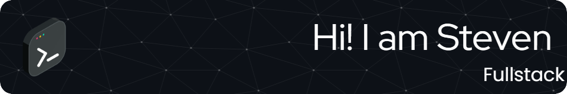

<h1 style="display: flex; align-items: baseline"> Know me better</h2>

    
    

<h1 style="display: flex; align-items: baseline"> Techs</h2>

<h3> Languages</h3>

    
    
    
    
    
    

<h1 style="display: flex; align-items: baseline"> Frontend libraries</h3>

    
    
    
    
    
    
    
    
    
    
    
    
    
    
    

<h1> Backend libraries</h3>

    
    
    
    

<h1> Database</h3>

    
    
    
    
    
    

<h1> Test</h3>

    
    
    
    

